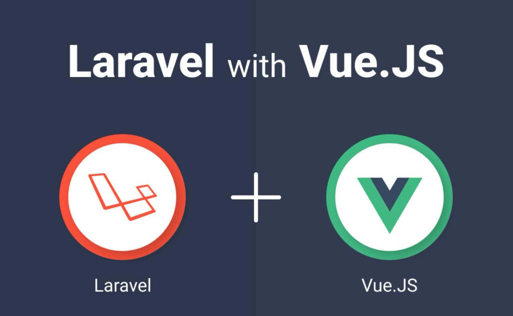

<p align="center">
  <!-- Imagen combinada de Laravel y Vue.js -->
  
</p>

<p align="center">
<a href="https://github.com/laravel/framework/actions"></a>
<a href="https://packagist.org/packages/laravel/framework"></a>
<a href="https://packagist.org/packages/laravel/framework"></a>
<a href="https://packagist.org/packages/laravel/framework"></a>
</p>


Instrucciones de ejecución del proyecto:

Backend (PHP/Laravel)

Utilicé PHP como lenguaje de programación y Laravel como framework.
Implementé pruebas unitarias utilizando PHPUnit.
La base de datos utilizada fue PostgreSQL.
Realicé varias migraciones para crear y llenar las tablas con los datos requeridos.
Para llenar las tablas, utilicé:

```bash
php artisan tinker
```

Luego en Psy Shell usar el comando por ejemplo para crear un Hotel:

```bash
$hotel = App\Models\Hotel::create(['name' => 'HotelLegs']);
```

Para ejecutar el servidor:

```bash
php artisan serve
```

Frontend (Vue.js/Pinia)

Desarrollé la interfaz de usuario utilizando Vue.js.
Implementé Pinia como gestor de estado.
Para ejecutar el frontend, se utiliza el comando:

```bash
npm run dev
```

Acceder a http://localhost:8000/.
 
Pruebas Unitarias y Automatización

En el backend, las pruebas unitarias se pueden ejecutar con:

```bash
npm run testphpunit
```

```bash
./vendor/bin/phpunit
```

En el FrontEnd, implementé pruebas unitarias con Jest para ejecutar:

```bash
npm run testjest
```

```bash
npx jest
```

Y agregue Cypress para automatización de pruebas. 

Los comandos para ejecutar Cypress son:

```bash
npm run cypress:run
```

```bash
npm run cypress:open
```
 
